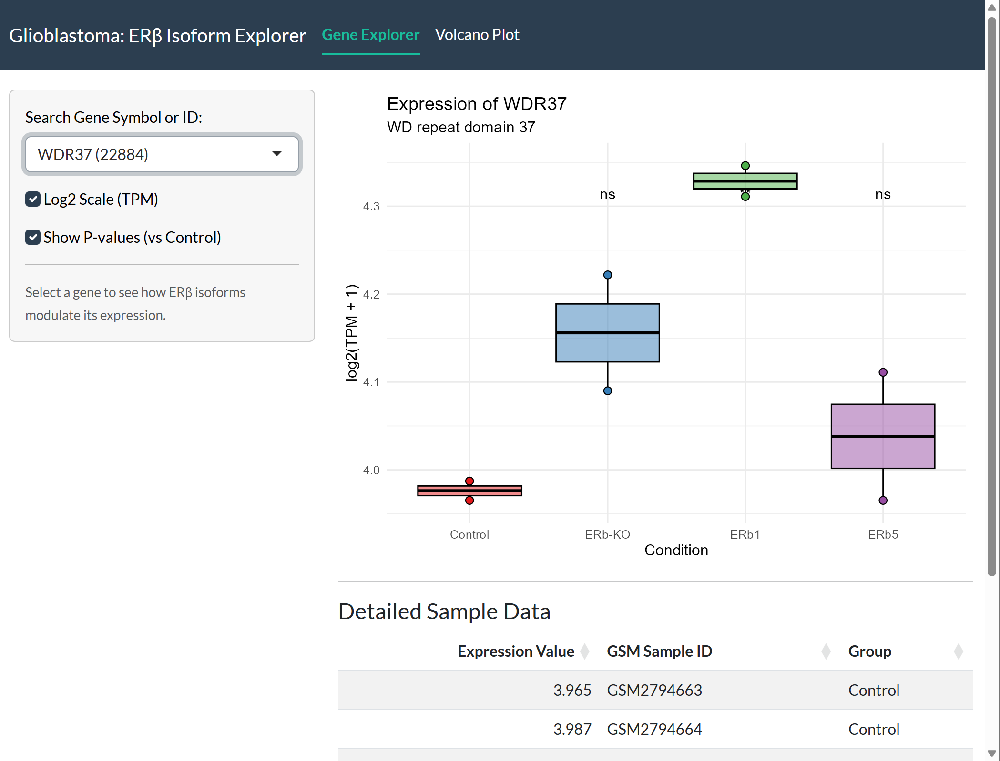
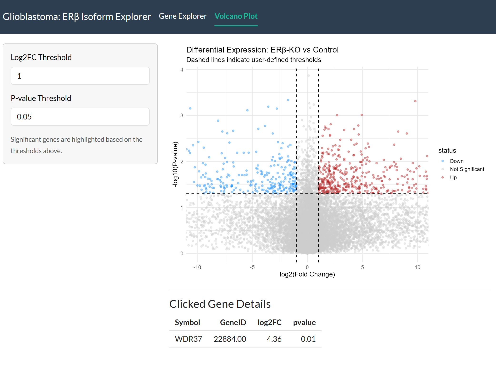

# Glioblastoma ERβ Isoform Explorer

## Preview

### Gene Expression Explorer

### Differential Expression Analysis

An interactive R/Shiny dashboard designed to visualize transcriptional changes in U87 glioblastoma cells. This tool compares gene expression across Control, ERβ-Knockout, and the reintroduction of ERβ1 and ERβ5 isoforms.

## Biological Context
This app utilizes RNA-seq data (TPM) from study **GSE104296**. It explores how specific Estrogen Receptor beta (ERβ) isoforms modulate unique pathways such as NF-κB, Jak/STAT, and mTOR signaling.

ERβ1: This is the "full-length" or standard version. It is generally the one that does the hard work of stopping the tumor.

ERβ5: This is a shorter variant. In many cancers, different isoforms can actually compete with each other. One might block the tumor, while another might be "silent" or even help the tumor hide from the immune system.

##  Features
- **Dynamic Search:** Explore 39,000+ genes using NCBI IDs or Gene Symbols.
- **Statistical Inference:** Automated p-value calculation comparing experimental groups to Control.
- **Data Integration:** Integrated raw sequencing counts with Bioconductor's `org.Hs.eg.db`.
- **Interactive UI:** Built with `shiny`, `ggplot2`, and `DT`.

## How to Run Locally
1. Clone this repository.
2. Ensure you have R/RStudio installed.
3. Perform preprocessing as per `preprocessing.qmd`
4. Run `shiny::runApp()`
